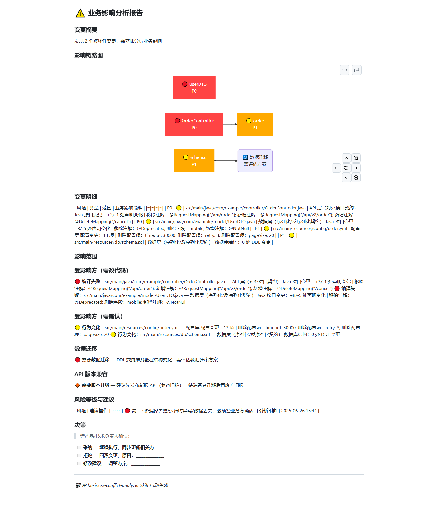

[](../../LICENSE)

# Business Conflict Analyzer

Detect API/field/schema breaking changes, analyze business impact, push bilingual reports. / 检测 API/字段/协议破坏性变更，分析业务影响，推送双语报告。

## Demo / 效果示例



*Report generated from a real git diff — [中文示例](docs/sample-report-zh.md) | [English sample](docs/sample-report-en.md)* / *基于真实 git diff 自动生成*

## Install / 安装

### Skill registration

```bash
claude add skill SKILL.md
```

### Commit guard (optional)

Install the `BeforeCommand` hook to **automatically block commits** with P0 breaking changes:

```bash
bash /path/to/skill/scripts/install_hook.sh
```

This adds a `.claude/settings.local.json` entry in your project that intercepts `git commit` and runs the analysis pipeline.

## Docs / 文档

See [SKILL.md](SKILL.md) for full documentation. / 完整文档见 [SKILL.md](SKILL.md)。
