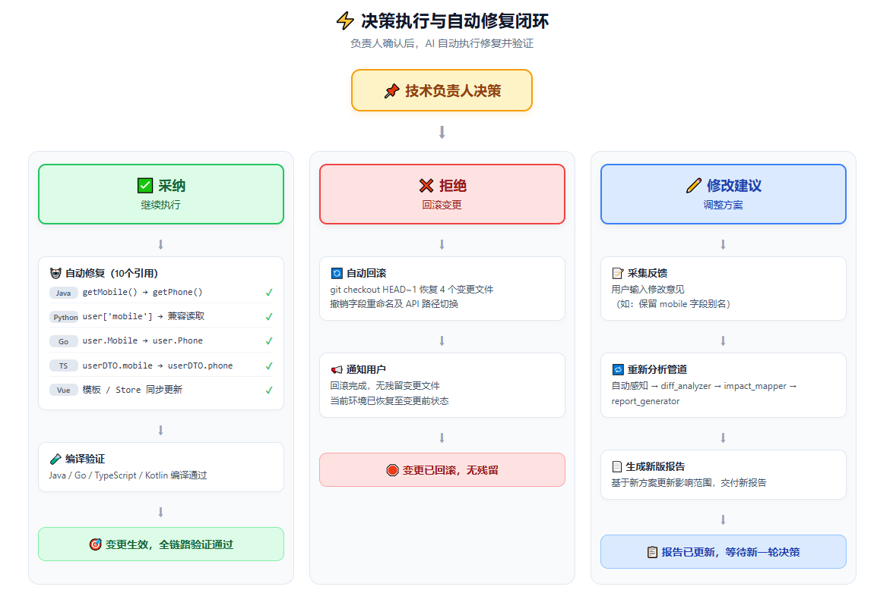
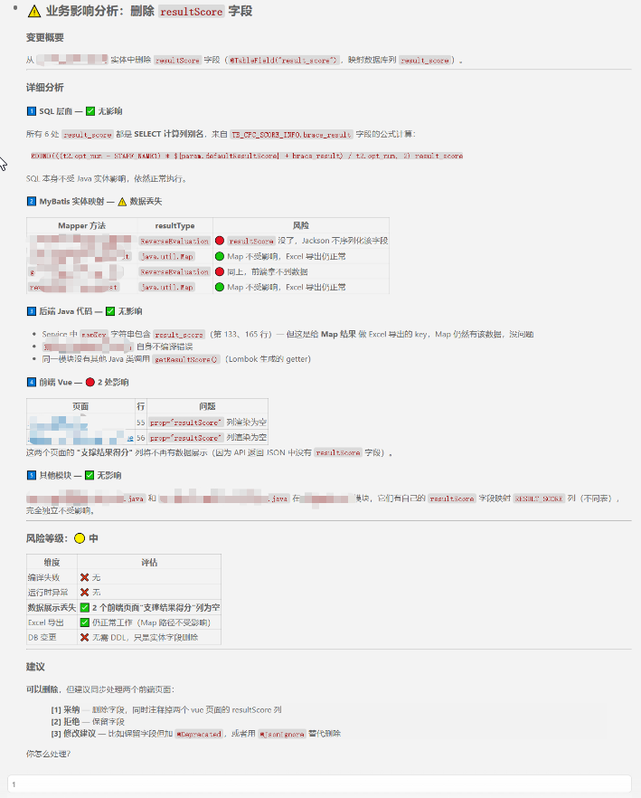

[](../../LICENSE)

# Business Conflict Analyzer

Detect API/field/schema breaking changes, analyze business impact, push bilingual reports. / 检测 API/字段/协议破坏性变更，分析业务影响，推送双语报告。

## Demo / 效果示例

### 1. Flow Overview / 流程总览

The analyzer has **4 flows** covering every scenario — from fully automatic to fully manual. / 分析器包含 **4 条流程**，覆盖从全自动到全手动的所有场景。

```
┌─ 有没有变更？ ─────────────────────────────────────────┐
│                                                        │
│  无 → "当前没有未提交的变更"                              │
│                                                        │
│  有 → 脚本能不能跑？                                     │
│        ├── 能 → ① 自动分析管道                            │
│        │         ├── Java/Spring → diff_analyzer.py     │
│        │         ├── Python/Django → extract_python     │
│        │         ├── TypeScript/NestJS → extract_ts     │
│        │         ├── Go → extract_go                    │
│        │         ├── Vue → extract_vue                  │
│        │         └── JSP → extract_jsp                  │
│        │                                                │
│        │         └── 报告生成 → 追问决策 → 执行         │
│        │                                                │
│        └── 不能 → ④ 降级分析 (AI 手动分析 git diff)     │
│                  └── 简化报告 → 追问决策 → 执行         │
│                                                        │
│  ② 按需触发：人说"分析一下" → 走自动管道                 │
│  ③ 多语言分流：按项目框架自动选择解析器                   │
└────────────────────────────────────────────────────────┘
```

| Flow / 流程 | Trigger / 触发方式 | Pipeline / 管道 | Output / 产出 |
|------------|-------------------|----------------|--------------|
| **① Auto-detect** | AI 写代码时自发感知 | 全自动 4 步 | 完整双语报告 + 决策追问 |
| **② On-demand** | 人说"分析一下" | 同 ① | 同上 |
| **③ Multi-lang** | 检测到非 Java 项目 | 按语言分流 | 同 ①，语言适配的分析 |
| **④ Degradation** | Python 脚本失败 | AI 手动分析 | 简化版报告 |


*Pipeline overview: from auto-detect to decision. / 管道总览：从自动感知到追问决策。*

---

### 2. ⭐ Main Flow: Auto-detect P0 / 自动拦截 P0

A real end‑to‑end example showing the full power of the analyzer. / 一个端到端案例，展示分析器的全部能力。

#### Scenario / 场景

Developer changes `UserDTO` — removes `mobile`, adds `phone`, changes an API route, adds a DDL migration.

开发者修改 `UserDTO`——删除 `mobile`、新增 `phone`、变更 API 路由、执行 DDL 迁移。

```
变更文件清单：
├── UserDTO.java          (删除mobile / 新增phone / @NotNull email)
├── OrderController.java  (/api/order → /api/v2/order)
├── order.yml             (删除3项配置)
└── schema.sql            (DDL变更)
```

#### What the Analyzer Detects / 分析器发现

| Detection / 检测项 | What It Found / 发现结果 |
|-------------------|------------------------|
| 🔴 **P0: Java ref** | `PaymentService.java` 调用了 `getMobile()` → **编译失败** |
| 🔴 **P0: Python ref** | `payment_service.py` 使用了 `user['mobile']` → **运行时异常** |
| 🔴 **P0: Go ref** | `user_handler.go` 访问了 `user.Mobile` → **编译失败** |
| 🔴 **P0: TypeScript ref** | `notification.module.ts` 引用 `userDTO.mobile` → **编译失败** |
| 🔴 **P0: Vue frontend** | `UserProfile.vue` 期望 `user.mobile` → **数据不匹配** |
| 🟡 **P1: Kotlin ref** | `UserApi.kt` 使用 `user.mobile` → **需同步更新** |
| 🟡 **P1: JSP ref** | `user-profile.jsp` 使用 `${user.mobile}` → **EL 异常** |
| 🟡 **P1: Config changes** | 3 个配置项被删除 → **将使用系统默认值** |
| 🟡 **P1: React ref** | `UserCard.tsx` props 中 `mobile` → **需同步** |
| 🔴 **Pattern match** | 匹配到模式库: **DTO字段删除** + **API路径变更** |
| 🔴 **Git history** | `UserDTO` 近 6 个月改过 3 次，关联 `PaymentService` |
| 🟡 **Data migration** | DDL 变更 → **需迁移存量数据** |
| 🔶 **API version** | 路径变更 → **建议先发新版兼容旧版** |

#### Guard Blocks the Commit / Guard 拦截提交

```
$ git commit -m "用户信息升级"

  ╔══════════════════════════════════════════════════╗
  ║  ❌ Commit blocked by Business Conflict Analyzer ║
  ║  2 P0 breaking changes detected                  ║
  ║  → conflict-report.md has been generated         ║
  ╚══════════════════════════════════════════════════╝
```

#### Impact Propagation / 影响传播链路


*Red = P0, Yellow = P1 / 红色 = P0，黄色 = P1*

#### Report Preview / 报告预览

```
⚠️ 变更摘要：2 个 P0 破坏性变更
├── UserDTO.java       删除 mobile + 新增 phone → 影响 6 个下游服务
├── OrderController.java  API 路径 /api/order → /api/v2/order

🔍 引用分析（多语言跨服务）
├── Java  PaymentService.java        getMobile() → 编译失败
├── Go    user_handler.go            user.Mobile → 编译失败
├── TS    notification.module.ts     userDTO.mobile → 编译失败
├── Python payment_service.py        user['mobile'] → 运行时异常
├── Vue   UserProfile.vue            响应字段不匹配
├── JSP   user-profile.jsp           EL 表达式失效
└── ...

⚡ 事后自动修复（用户采纳后）
├── 10 个受影响引用 → 10 个已自动修复 ✅
├── 编译验证通过（Java / Go / TS / Kotlin）
└── 0 跳过
```

完整报告：
- 🔗 [中文示例](docs/sample-report-zh.md)
- 🔗 [English sample](docs/sample-report-en.md)

#### Decision & Auto-Fix / 决策与自动修复

The user gets 3 options, replies with a number → AI executes:

```
How would you like to proceed?

[1] **Accept** — proceed, auto-fix all impacted consumers
[2] **Reject** — roll back the change, no action taken
[3] **Revise** — adjust approach (tell me what to change)
```

_System locale auto-detected — if Chinese, shows in Chinese._ / _自动识别系统语言，中文环境显示中文。_

If the user says **"1"** → AI immediately auto-fixes all consumers. / 用户说 **"1"** → AI 立即自动修复所有受影响引用方。


*Decision loop: Accept → auto-fix → verify. / 决策闭环：采纳 → 自动修复 → 编译验证。*

---

### ⭐ 3. Real-world Case / 真实案例

> Analysis from an actual Spring Boot + MyBatis + Vue project. / 来自真实 Spring Boot + MyBatis + Vue 项目的分析结果。

The user asked: **"ReverseEvaluation类的resultScore字段可以删除吗？"**


*AI analysis output with risk assessment and decision options. / AI 分析输出：风险评估 + 决策选项。*

**What the analyzer found / 分析器发现：**

```
业务影响分析：删除 resultScore 字段

变更概要
从 ReverseEvaluation 实体中删除 resultScore 字段（@TableField("result_score")，映射数据库列 result_score）。

1️⃣ SQL 层面 — ✅ 无影响
所有 6 处 result_score 都是 SELECT 计算列别名，SQL 不受 Java 实体影响。

2️⃣ MyBatis 实体映射 — ⚠️ 数据丢失
├── getDepartmentScorePageList  → ReverseEvaluation  → 🔴 resultScore 没了
├── departmentScoreReportList   → Map               → 🟢 不受影响（Excel 导出正常）
├── getReverseScalePageList     → ReverseEvaluation  → 🔴 同上
└── reverseScaleReportList      → Map               → 🟢 不受影响（Excel 导出正常）

3️⃣ 后端 Java 代码 — ✅ 无影响
Service 中使用 result_score 作为 Map key 给 Excel 导出，Map 仍有该数据。
ReverseEvaluation 自身不编译错误。

4️⃣ 前端 Vue — 🔴 2 处影响
├── reverseScale.vue:55               prop="resultScore" 列渲染为空
└── departmentalScoreReport.vue:56    prop="resultScore" 列渲染为空

5️⃣ 其他模块 — ✅ 无影响
support-sys 模块 ReverseEvaluBscoreResult.java 独立映射不同表，不受影响。

风险等级：🟡 中

建议：
[1] 采纳 — 删除字段，同时注释掉两个 vue 页面的 resultScore 列
[2] 拒绝 — 保留字段
[3] 修改建议 — 保留字段加 @Deprecated，或用 @JsonIgnore 替代删除
```

**Key takeaways / 关键收获：**

| Dimension / 维度 | Assessment / 评估 |
|---|---|
| 🔴 Compile failure | ❌ None — single-column entity removal compiles clean |
| 🔴 Runtime exception | ❌ None — Map-based paths remain unaffected |
| 🟡 Data display loss | ✅ 2 Vue pages lose column data — frontend sync needed |
| 🟡 Excel export | ✅ Still works (Map path) |
| 🟢 DB change | ❌ Not needed — entity field removal only |

---

### 4. More Flows / 更多场景

#### ② On-Demand Trigger / 按需触发

You can also manually trigger the analysis anytime: / 你也可以随时手动触发分析：

> **"分析一下这个变更"** or **"impact analysis"**

AI will check `git diff`, run the pipeline, and output a report — no parameters needed.

AI 会检查 `git diff`，运行分析管道，输出报告——不需要指定参数。

#### ④ Degradation Flow / 降级流程

If Python scripts fail (wrong directory, no Python, pipe broken), AI falls back to manual analysis: / 如果脚本执行失败，AI 自动降级为手动分析：

```
diff_analyzer.py 失败
    ↓
AI 告知："脚本执行失败，切换到手动分析"
    ↓
AI 读取 git diff 文本 → 手动识别变更类型
  → 手动判断风险等级 → 输出简化版报告
  → 追问决策 → 执行
```

No scripts needed — the AI itself understands all the patterns. / 不需要脚本——AI 自己就理解所有冲突模式。

#### ③ Multi-Language Branching / 多语言分流

The analyzer auto-detects your project's framework and uses language-specific parsing: / 分析器自动识别项目框架，使用语言适配的解析逻辑：

| Language / 语言 | Frameworks / 框架 | Detection / 检测重点 |
|----------------|-------------------|---------------------|
| **Java** | Spring Boot, MyBatis | DTO, Controller, Feign, Mapper, @Transactional |
| **Kotlin** | Ktor, Spring Boot | Data class, Controller, Coroutines |
| **Python** | Django/DRF, FastAPI, Flask | Serializer, Model, View, Router |
| **TypeScript** | NestJS, Express | Decorator, Guard, Pipe, Module, Interface |
| **Go** | Gin, Kratos | Struct, Handler, Transport, Usecase |
| **Vue** | Vue 2/3, Pinia, Vuex | props, emit, store, v-model, provide/inject |
| **React** | Redux, Next.js | props, context, hooks, JSX props |
| **JSP** | JSP 2.x, JSTL | taglib, include, bean property |

---

### 5. Try It Yourself / 快速体验

Want to see it in action? Try this in your own project: / 想亲眼看看效果？在你的项目里试试这个：

```bash
# 1. Make a breaking change — delete a DTO field
#    改一个破坏性变更——删一个 DTO 字段

# 2. Run git commit (or tell Claude "分析一下")
#    执行 git commit（或让 Claude "分析一下"）

# 3. Watch the report appear
#    等着看报告出来
```

**What to expect / 你会看到：**
- AI 自动感知变更 → 运行管道 → 输出双语报告 → 问你要不要采纳
- 如果有 P0 风险，Guard 会拦下提交
- 采纳后 AI 自动修复所有受影响引用方

> 💡 **Tip**: Try renaming a field, changing an API path, or modifying a DDL — those trigger the most complete analysis.

> 💡 **建议**：试试改字段名、改 API 路径、或改 DDL——这些会触发最完整的分析。

## Install / 安装

### 1. Register skill / 注册技能

In the Claude Code dialog, tell it:

> **claude add skill https://github.com/GoBeyondYang/skills/raw/main/skills/business-conflict-analyzer/SKILL.md**

Claude will download the skill and all its scripts. It will then auto-trigger whenever it detects a breaking change during coding.

### 2. Install commit guard (optional) / 安装提交拦截

The guard **automatically blocks `git commit`** when P0 breaking changes are detected.

After registering the skill, tell Claude in the dialog:

> **帮我安装 commit guard**

Claude will find `scripts/install_hook.sh` in the skill directory and set up the `BeforeCommand` hook in your project's `.claude/settings.local.json`.

**What it does** / 工作原理：

```
git commit
    ↓
BeforeCommand hook fires → runs commit_guard.py
    ↓
    ├─ P0 detected → commit blocked → conflict-report.md generated
    │                 → Claude reads report → asks Accept/Reject/Revise
    │
    └─ No P0      → commit proceeds normally
```

## Docs / 文档

See [SKILL.md](SKILL.md) for full documentation. / 完整文档见 [SKILL.md](SKILL.md)。
