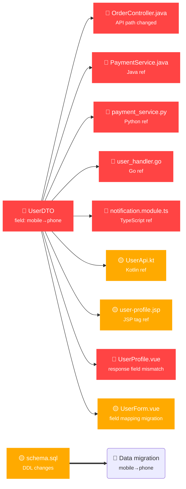

## ⚠️ Business Impact Analysis Report

### 📋 Change Summary

User info upgrade involves **4 files** changed, **3 breaking changes** detected:

| Risk | Count | Description |
|:---:|:----:|-------------|
| 🔴 P0 | 2 | Downstream compile failure / runtime exception |
| 🟡 P1 | 1 | Backward-compatible behavior change |

### 🔗 Impact Dependency Graph



### 📄 Change Details

| Risk | Type | File | Business Impact |
|:---:|:----:|------|----------------|
| 🔴 P0 | 🟡 API layer (external contract) | `OrderController.java`<br/>`@RequestMapping("/api/order")` → `@RequestMapping("/api/v2/order")`<br/>New `@DeleteMapping("/cancel")` | **API path changed**: all clients calling `/api/order` will get 404; new cancel endpoint added |
| 🔴 P0 | 🔴 Data layer (serialization contract) | `UserDTO.java`<br/>Removed field `mobile`<br/>New field `phone`<br/>New `@NotNull email` | **User API will no longer return mobile number**, replaced by new phone field; email now required |
| 🟡 P1 | 🟡 Configuration layer | `order.yml`<br/>Removed `timeout: 30000`<br/>Removed `retry: 3`<br/>Removed `pageSize: 20` | Order service timeout and retry will use defaults — confirm new expected values |
| 🟡 P1 | 🔴 Data layer (storage) | `schema.sql`<br/>DDL changes | Database structure changes require data migration |

### 🔍 Reference Analysis

#### 🔴 Backend References (Multi-language Cross-Service)

| Impact | Lang | File | Reference | Source |
|--------|:----:|------|-----------|--------|
| 🔴 Compile failure | Java | `PaymentService.java:45` | `user.getMobile()` | Project-wide grep reference search |
| 🔴 Runtime error | Python | `payment_service.py:23` | `user['mobile']` | Project-wide grep reference search |
| 🔴 Compile failure | Go | `user_handler.go:67` | `user.Mobile` | Go struct field access detection |
| 🔴 Compile failure | TypeScript | `notification.module.ts:34` | `userDTO.mobile` | TS interface property reference detection |
| 🟡 Behavior change | Kotlin | `UserApi.kt:52` | `user.mobile` | Kotlin data class property reference |
| 🟡 Runtime error | JSP | `user-profile.jsp:18` | `${user.mobile}` | JSP taglib / EL expression detection |
| 🟡 Behavior change | Java | `RefundService.java:88` | Indirect reference via `user.getMobile()` | Git history relation (2 changes in 6 months) |

> **Git history trace**: `UserDTO.java` modified 3 times in the past 6 months. Historically related files: `PaymentService.java`, `RefundService.java`

#### 🔴 Frontend Impact (Vue / React)

| Impact | File | Description |
|--------|------|-------------|
| 🔴 Data mismatch | `UserProfile.vue:12` | Component expects `user.mobile`, API no longer returns it |
| 🟡 Field mapping | `UserForm.vue:30` | Form submits `mobile` → should upgrade to `phone` with backend |
| 🟡 Store state | `store/user.js` | Pinia store `user.mobile` reference needs update |
| 🟡 Props passing | `UserCard.tsx:22` | React component `UserCard` prop `mobile` → `phone` |

> **Frontend auto-discovery**: Frontend project detected via `FRONTEND_ROOT` env var and common monorepo layout heuristics

#### 📐 Pattern Match Results

| Pattern | Trigger Keywords | Impact | Fix Cost |
|---------|----------------|--------|----------|
| **DTO field removed** | mobile, dto, response field | BREAKING | Medium — all consumers update field references |
| **API path changed** | RequestMapping, api, controller | BREAKING | High — client sync upgrade or nginx routing |
| **DDL structure changed** | ALTER, TABLE, schema | BREAKING | High — data migration plan required |

> Matched from `common_patterns.md` pattern library — extendable in references/

### 🌐 Impact Scope

#### Affected Parties (code changes required)

| Level | Lang | File | Reason |
|:----:|:----:|------|--------|
| 🔴 | Java | `PaymentService.java:45` | `user.getMobile()` — field no longer exists, compile error |
| 🔴 | Python | `payment_service.py:23` | `user['mobile']` — response structure changed, runtime error |
| 🔴 | Go | `user_handler.go:67` | `user.Mobile` — Go struct field missing, compile error |
| 🔴 | TypeScript | `notification.module.ts:34` | `userDTO.mobile` — interface property changed, compile error |
| 🔴 | JSP | `user-profile.jsp:18` | `${user.mobile}` — EL expression returns null |
| 🔴 | Vue | `UserProfile.vue:12` | Frontend expects `mobile` field, API now returns `phone` |
| 🔴 | Java | `OrderController.java` | API path changed, downstream callers must update |
| 🟡 | Kotlin | `UserApi.kt:52` | `user.mobile` — data class mapping needs update |
| 🟡 | Vue | `UserForm.vue:30` | Form field pending migration to new field name |
| 🟡 | Vue | `store/user.js` | Store state fields pending update |
| 🟡 | React | `UserCard.tsx:22` | React props `mobile` → `phone` |

#### Affected Parties (confirmation needed)

| Level | File | Reason |
|:----:|------|--------|
| 🟡 | `order.yml` | Config keys removed, will fall back to system defaults |
| 🟡 | `schema.sql` | DDL changes — confirm execution window |

### 🗄️ Data Migration

🔴 **Migration required** — existing `mobile` data must be migrated to `phone` column

Suggested approach:
1. Add new `phone` column; write migration script to copy existing `mobile` data
2. Dual-write compatibility period in application layer before retiring `mobile` column
3. Use online DDL tools (gh-ost / pt-online-schema-change) to minimize table locks

### 🔶 API Version Compatibility

🔶 **Release new API version first (backward compatible)**, deprecate old version after consumers migrate

```
Retain old route: @RequestMapping("/api/order") + @Deprecated
Add new route:   @RequestMapping("/api/v2/order")
Add nginx rewrite or internal redirect
```

### ⚡ Post-Accept Auto-Fix Report

> The following fixes were **automatically applied by AI** after the user chose "Accept"

| # | Lang | File | Fix Applied | Status |
|:-:|:----:|------|-------------|:-----:|
| 1 | Java | `PaymentService.java:45` | `getMobile()` → `getPhone()` | ✅ |
| 2 | Python | `payment_service.py:23` | `user['mobile']` → `user.get('phone', user.get('mobile'))` (compat read) | ✅ |
| 3 | Go | `user_handler.go:67` | `user.Mobile` → `user.Phone` | ✅ |
| 4 | TypeScript | `notification.module.ts:34` | `userDTO.mobile` → `userDTO.phone` | ✅ |
| 5 | Kotlin | `UserApi.kt:52` | `user.mobile` → `user.phone` | ✅ |
| 6 | JSP | `user-profile.jsp:18` | `${user.mobile}` → `${user.phone}` | ✅ |
| 7 | Vue | `UserProfile.vue:12` | `user.mobile` → `user.phone`; template rendering updated | ✅ |
| 8 | Vue | `UserForm.vue:30` | Form field `mobile` → `phone`; v-model binding updated | ✅ |
| 9 | Vue | `store/user.js` | Pinia store `mobile` reference updated to `phone` | ✅ |
| 10 | React | `UserCard.tsx:22` | props `mobile` → `phone`; type interface updated | ✅ |

```
Auto-fix complete: 10 impacted consumers → 10 auto-fixed ✅
Compilation: verified clean (Java / Go / TypeScript / Kotlin)
0 skipped
```

### 🏷️ Risk Assessment & Recommendation

| Risk | Recommended Action |
|:---:|-------------------|
| **🔴 High** | Downstream compilation failure / runtime error / data loss — **must be confirmed by business owner** |
| **Analysis time** | 2.3s (reference search 1.8s + history query 0.3s + report generation 0.2s) |

### ✅ Decision

> Reply with number:

- **[1] Accept** — proceed, auto-fix all impacted consumers
- **[2] Reject** — rollback change
- **[3] Revise** — adjust approach

---

*🤖 Generated by business-conflict-analyzer Skill — Pipeline: auto-detect → diff_analyzer → impact_mapper → report_generator → decision loop*
