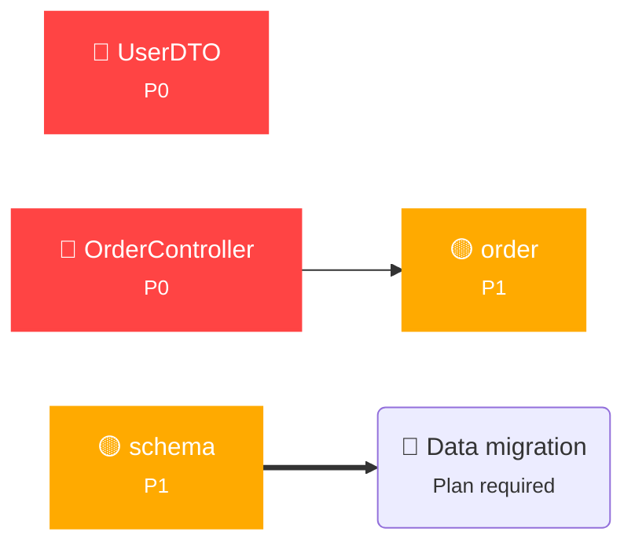

## ⚠️ Business Impact Analysis Report

### Change Summary

Found 2 breaking change(s) — immediate impact analysis required

### Impact Dependency Graph

### Change Details

| Risk | Type | Scope | Business Impact |
|:::|:::|:::|:::|
| P0 | 🟡  | src/main/java/com/example/controller/OrderController.java | API layer (external interface contract) Java interface changed: +3/-1 declarations | Annotation removed: @RequestMapping("/api/order"); New annotation: @RequestMapping("/api/v2/order"); New annotation: @DeleteMapping("/cancel") |
| P0 | 🟡  | src/main/java/com/example/model/UserDTO.java | Data layer (serialization/deserialization contract) Java interface changed: +8/-5 declarations | Annotation removed: @Deprecated; Field 'mobile' removed; New annotation: @NotNull |
| P1 | 🟡  | src/main/resources/config/order.yml | Configuration layer Configuration changed: 13 item(s) | Config key removed: timeout: 30000; Config key removed: retry: 3; Config key removed: pageSize: 20 |
| P1 | 🟡  | src/main/resources/db/schema.sql | Data layer (serialization/deserialization contract) Database schema: 0 structural change(s) |

### Impact Scope

### Affected Parties (code changes required)
🔴 **Compile failure**: src/main/java/com/example/controller/OrderController.java — API layer (external interface contract) Java interface changed: +3/-1 declarations | Annotation removed: @RequestMapping("/api/order"); New annotation: @RequestMapping("/api/v2/order"); New annotation: @DeleteMapping("/cancel")
🔴 **Compile failure**: src/main/java/com/example/model/UserDTO.java — Data layer (serialization/deserialization contract) Java interface changed: +8/-5 declarations | Annotation removed: @Deprecated; Field 'mobile' removed; New annotation: @NotNull

### Affected Parties (confirmation needed)
🟡 **Behavior change**: src/main/resources/config/order.yml — Configuration layer Configuration changed: 13 item(s) | Config key removed: timeout: 30000; Config key removed: retry: 3; Config key removed: pageSize: 20
🟡 **Behavior change**: src/main/resources/db/schema.sql — Data layer (serialization/deserialization contract) Database schema: 0 structural change(s)

### Data Migration

🔴 **Migration required** — DDL changes involve schema changes — data migration plan required

### API Version Compatibility

🔶 **Version upgrade needed** — Release new API version first (backward compatible), deprecate old version after consumers migrate

### Risk Assessment & Recommendation

| Risk | **Recommended Action** |
|:::|:::|
| **🔴 High** | Downstream compilation failure / runtime error / data loss — must be confirmed by business owner |
| **Analysis time** | 2026-06-26 15:44 |

### Decision

> Product / Tech lead confirms:

- [ ] **Accept — proceed with changes, notify affected parties**
- [ ] **Reject — rollback, reason: _______________**
- [ ] **Revision needed — adjust approach: _______________**

---

*🤖 Generated by business-conflict-analyzer Skill*

