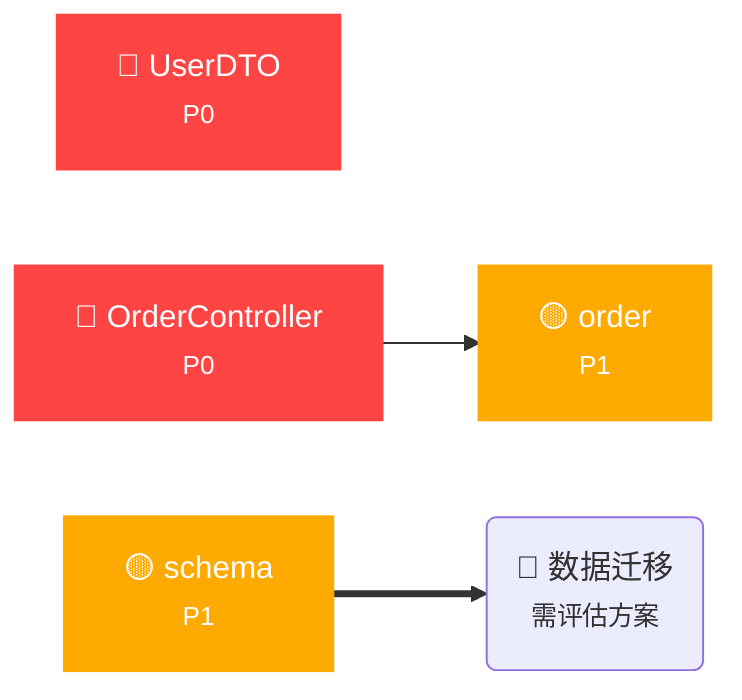

## ⚠️ 业务影响分析报告

### 变更摘要

发现 2 个破坏性变更，需立即分析业务影响

### 影响链路图

### 变更明细

| 风险 | 类型 | 范围 | 业务影响说明 |
|:::|:::|:::|:::|
| P0 | 🟡  | src/main/java/com/example/controller/OrderController.java | API 层（对外接口契约） Java 接口变更：+3/-1 处声明变化 | 移除注解：@RequestMapping("/api/order"); 新增注解：@RequestMapping("/api/v2/order"); 新增注解：@DeleteMapping("/cancel") |
| P0 | 🟡  | src/main/java/com/example/model/UserDTO.java | 数据层（序列化/反序列化契约） Java 接口变更：+8/-5 处声明变化 | 移除注解：@Deprecated; 删除字段：mobile; 新增注解：@NotNull |
| P1 | 🟡  | src/main/resources/config/order.yml | 配置层 配置变更：13 项 | 删除配置项：timeout: 30000; 删除配置项：retry: 3; 删除配置项：pageSize: 20 |
| P1 | 🟡  | src/main/resources/db/schema.sql | 数据层（序列化/反序列化契约） 数据库结构：0 处 DDL 变更 |

### 影响范围

### 受影响方（需改代码）
🔴 **编译失败**：src/main/java/com/example/controller/OrderController.java — API 层（对外接口契约） Java 接口变更：+3/-1 处声明变化 | 移除注解：@RequestMapping("/api/order"); 新增注解：@RequestMapping("/api/v2/order"); 新增注解：@DeleteMapping("/cancel")
🔴 **编译失败**：src/main/java/com/example/model/UserDTO.java — 数据层（序列化/反序列化契约） Java 接口变更：+8/-5 处声明变化 | 移除注解：@Deprecated; 删除字段：mobile; 新增注解：@NotNull

### 受影响方（需确认）
🟡 **行为变化**：src/main/resources/config/order.yml — 配置层 配置变更：13 项 | 删除配置项：timeout: 30000; 删除配置项：retry: 3; 删除配置项：pageSize: 20
🟡 **行为变化**：src/main/resources/db/schema.sql — 数据层（序列化/反序列化契约） 数据库结构：0 处 DDL 变更

### 数据迁移

🔴 **需要数据迁移** — DDL 变更涉及数据结构变化，需评估数据迁移方案

### API 版本兼容

🔶 **需要版本升级** — 建议先发布新版 API（兼容旧版），待消费者迁移后再废弃旧版

### 风险等级与建议

| 风险 | **建议操作** |
|:::|:::|
| **🔴 高** | 下游编译失败/运行时异常/数据丢失，必须经业务方确认 |
| **分析时间** | 2026-06-26 15:44 |

### 决策

> 请产品/技术负责人确认：

- [ ] **采纳 — 继续执行，同步更新相关方**
- [ ] **拒绝 — 回滚变更，原因：_______________**
- [ ] **修改建议 — 调整方案：_______________**

---

*🤖 由 business-conflict-analyzer Skill 自动生成*

