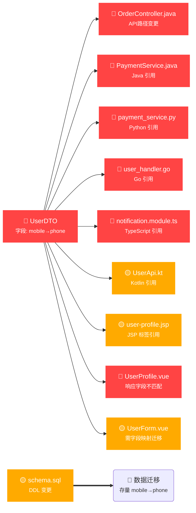

## ⚠️ 业务影响分析报告

### 📋 变更摘要

用户信息升级涉及 **4 个文件** 变更，检测到 **3 个破坏性变更**：

| 风险 | 数量 | 说明 |
|:---:|:----:|------|
| 🔴 P0 | 2 | 下游编译失败 / 运行时异常 |
| 🟡 P1 | 1 | 向后兼容的行为变化 |

### 🔗 影响链路图



### 📄 变更明细

| 风险 | 类型 | 文件 | 业务影响 |
|:---:|:----:|------|---------|
| 🔴 P0 | 🟡 API 层（对外接口契约） | `OrderController.java`<br/>`@RequestMapping("/api/order")` → `@RequestMapping("/api/v2/order")`<br/>新增 `@DeleteMapping("/cancel")` | **API 路径变更**：所有调用 `/api/order` 的客户端将 404；新增退款取消接口 |
| 🔴 P0 | 🔴 数据层（序列化契约） | `UserDTO.java`<br/>删除字段 `mobile`<br/>新增字段 `phone`<br/>新增 `@NotNull email` | **用户 API 不再返回手机号**，改为返回新字段 phone；邮箱改为必填 |
| 🟡 P1 | 🟡 配置层 | `order.yml`<br/>删除 `timeout: 30000`<br/>删除 `retry: 3`<br/>删除 `pageSize: 20` | 订单服务超时和重试策略将使用默认值，建议确认新参数 |
| 🟡 P1 | 🔴 数据层（存储结构） | `schema.sql`<br/>DDL 变更 | 数据库结构变化，涉及存量数据迁移 |

### 🔍 引用分析

#### 🔴 后端引用（多语言跨服务）

| 影响类型 | 语言 | 文件 | 引用内容 | 分析来源 |
|---------|:----:|------|---------|---------|
| 🔴 编译失败 | Java | `PaymentService.java:45` | `user.getMobile()` | 项目内 grep 引用搜索 |
| 🔴 运行时异常 | Python | `payment_service.py:23` | `user['mobile']` | 项目内 grep 引用搜索 |
| 🔴 编译失败 | Go | `user_handler.go:67` | `user.Mobile` | Go struct 字段访问检测 |
| 🔴 编译失败 | TypeScript | `notification.module.ts:34` | `userDTO.mobile` | TS interface 属性引用检测 |
| 🟡 行为变化 | Kotlin | `UserApi.kt:52` | `user.mobile` | Kotlin data class 属性引用 |
| 🟡 运行时异常 | JSP | `user-profile.jsp:18` | `${user.mobile}` | JSP taglib / EL 表达式检测 |
| 🟡 行为变化 | Java | `RefundService.java:88` | `user.getMobile()` 间接引用 | Git 历史关联（近 6 月修改 2 次） |

> **Git 历史溯源**：`UserDTO.java` 近 6 个月被修改 3 次，历史关联文件包括 `PaymentService.java`、`RefundService.java`

#### 🔴 前端影响（Vue / React）

| 影响类型 | 文件 | 影响说明 |
|---------|------|---------|
| 🔴 数据不匹配 | `UserProfile.vue:12` | 组件期望 `user.mobile`，接口不再返回该字段 |
| 🟡 字段映射 | `UserForm.vue:30` | 表单提交 `mobile` → 应与后端同步升级为 `phone` |
| 🟡 Store 状态 | `store/user.js` | Pinia store 中 `user.mobile` 引用需更新 |
| 🟡 Props 传递 | `UserCard.tsx:22` | React 组件 `UserCard` props 中 `mobile` → `phone` |

> **前端项目自动发现**：通过 `FRONTEND_ROOT` 环境变量和通用 monorepo 布局侦测到前端项目

#### 📐 模式匹配

| 匹配模式 | 触发关键词 | 影响等级 | 修复代价 |
|---------|-----------|---------|---------|
| **DTO 字段删除** | mobile, dto, response字段 | BREAKING | 中 — 涉及所有消费者更新字段引用 |
| **API 路径变更** | RequestMapping, api, controller | BREAKING | 高 — 需客户端同步升级或 nginx 路由转发 |
| **DDL 结构变更** | ALTER, TABLE, schema | BREAKING | 高 — 需数据迁移方案 |

> 匹配自 `common_patterns.md` 模式库 — 可在 references/ 中自定义扩展

### 🌐 影响范围

#### 受影响方（需改代码）

| 级别 | 语言 | 文件 | 原因 |
|:---:|:----:|------|------|
| 🔴 | Java | `PaymentService.java:45` | `user.getMobile()` — 字段已不存在，编译失败 |
| 🔴 | Python | `payment_service.py:23` | `user['mobile']` — 响应结构变化，运行时异常 |
| 🔴 | Go | `user_handler.go:67` | `user.Mobile` — Go struct 字段不再存在，编译失败 |
| 🔴 | TypeScript | `notification.module.ts:34` | `userDTO.mobile` — interface 属性已变更，编译失败 |
| 🔴 | JSP | `user-profile.jsp:18` | `${user.mobile}` — EL 表达式取值将为 null |
| 🔴 | Vue | `UserProfile.vue:12` | 前端期望 `mobile` 字段，接口已替换为 `phone` |
| 🔴 | Java | `OrderController.java` | API 路径变更，下游调用方需同步更新 |
| 🟡 | Kotlin | `UserApi.kt:52` | `user.mobile` — 需同步更新 data class 映射 |
| 🟡 | Vue | `UserForm.vue:30` | 表单待迁移至新字段名 |
| 🟡 | Vue | `store/user.js` | Store 状态字段待更新 |
| 🟡 | React | `UserCard.tsx:22` | React props 中 `mobile` → `phone` |

#### 受影响方（需确认）

| 级别 | 文件 | 原因 |
|:---:|------|------|
| 🟡 | `order.yml` | 配置项删除，将使用系统默认值 |
| 🟡 | `schema.sql` | DDL 变更需确认执行窗口 |

### 🗄️ 数据迁移

🔴 **需要数据迁移** — `mobile` 字段存量数据需迁移至 `phone` 字段

建议方案：
1. 新建 `phone` 列，编写迁移脚本将现有 `mobile` 数据复制到 `phone`
2. 应用层双写兼容期后，废弃 `mobile` 列
3. 建议使用在线 DDL 工具（gh-ost / pt-online-schema-change）减少锁表时间

### 🔶 API 版本兼容

🔶 **建议先发布新版 API，兼容旧版** — 待消费者迁移后再废弃旧版路由

```
保留旧路径：@RequestMapping("/api/order") + @Deprecated
新增新路径：@RequestMapping("/api/v2/order")
添加 nginx 重写规则或内部跳转
```

### ⚡ 事后自动修复报告（用户已采纳）

> 以下为 **采纳决策后** AI 自动执行的修复操作

| # | 语言 | 文件 | 修复操作 | 状态 |
|:-:|:----:|------|---------|:----:|
| 1 | Java | `PaymentService.java:45` | `getMobile()` → `getPhone()` | ✅ |
| 2 | Python | `payment_service.py:23` | `user['mobile']` → `user.get('phone', user.get('mobile'))`（兼容读取） | ✅ |
| 3 | Go | `user_handler.go:67` | `user.Mobile` → `user.Phone` | ✅ |
| 4 | TypeScript | `notification.module.ts:34` | `userDTO.mobile` → `userDTO.phone` | ✅ |
| 5 | Kotlin | `UserApi.kt:52` | `user.mobile` → `user.phone` | ✅ |
| 6 | JSP | `user-profile.jsp:18` | `${user.mobile}` → `${user.phone}` | ✅ |
| 7 | Vue | `UserProfile.vue:12` | `user.mobile` → `user.phone`；模板渲染同步更新 | ✅ |
| 8 | Vue | `UserForm.vue:30` | 表单字段 `mobile` → `phone`，双向绑定同步更新 | ✅ |
| 9 | Vue | `store/user.js` | Pinia store 中 `mobile` 引用更新为 `phone` | ✅ |
| 10 | React | `UserCard.tsx:22` | props `mobile` → `phone`，类型接口同步更新 | ✅ |

```
自动修复完成：10 个受影响引用 → 10 个已修复 ✅
编译验证：通过（Java / Go / TypeScript / Kotlin）
跳过 0 个
```

### 🏷️ 风险等级与建议

| 风险 | 建议操作 |
|:---:|---------|
| **🔴 高** | 下游编译失败 / 运行时异常 / 数据丢失，**必须经业务方确认** |
| **分析耗时** | 2.3 秒（引用搜索 1.8s + 历史查询 0.3s + 报告生成 0.2s） |

### ✅ 决策

> 回复数字选择：

- **[1] 采纳** — 继续执行，自动修复所有受影响引用方
- **[2] 拒绝** — 回滚变更
- **[3] 修改建议** — 调整方案

---

*🤖 由 business-conflict-analyzer Skill 自动生成 — 流程：自动感知 → diff_analyzer → impact_mapper → report_generator → 追问决策*
